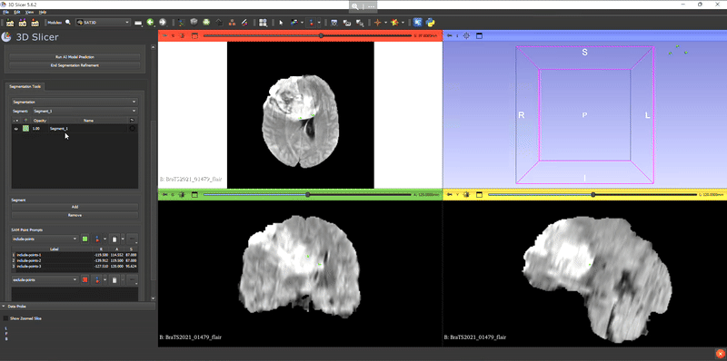

# Segment Any Tumour: An Uncertainty-Aware Vision Foundation Model for Whole-Body Analysis
This repo contains the supported pytorch code and configuration files to reproduce the results of Segment Any Tumour: An Uncertainty-Aware Vision Foundation Model for Whole-Body Analysis Article.

## Abstract

Prompt-driven vision foundation models, such as the Segment Anything Model (SAM), have recently demonstrated remarkable adaptability in computer vision. However, their direct application to medical imaging remains challenging due to heterogeneous tissue structures, imaging artefacts, and low-contrast boundaries, particularly in tumours and cancer primaries leading to suboptimal segmentation in ambiguous or overlapping lesion regions.
Here, we present Segment Any Tumour 3D (SAT3D), a volumetric foundation model designed to enable robust and generalizable tumour segmentation across diverse medical imaging modalities. SAT3D integrates a shifted-window vision transformer for hierarchical volumetric representation with an uncertainty-aware training pipeline that explicitly incorporates uncertainty estimates as prompts to guide reliable boundary prediction in low-contrast regions. Adversarial learning further enhances discrimination under ambiguous conditions.
We benchmark SAT3D against three recent vision foundation models and nnUNet across 11 publicly available datasets, encompassing 3,884 tumour and cancer cases for training and 694 cases for in-distribution evaluation. Trained on 17,075 3D volume–mask pairs across multiple modalities and cancer primaries, SAT3D demonstrates strong generalisation and robustness. Extensive experiments highlight its effectiveness in improving segmentation accuracy under challenging and out-of-distribution scenarios, underscoring its potential as a scalable foundation model for medical image analysis.

## Link to full paper:
Pre-print version: https://arxiv.org/abs/2511.09592

## Proposed Architecture


## System requirements
Under this section, we provide details on the environmental setup and dependencies required to train/test the SAT3D model.
This software was originally designed and run on a system running Ubuntu.
<br>
All the experiments are conducted on Ubuntu 20.04 Focal version with Python 3.9.
<br>
To train SAT3D with the given settings, the system requires a GPU with at least 40GB. All the experiments are conducted on Nvidia A6000 2 GPUs (Tested on Setonix AMD GPUs).
(Not required any non-standard hardware)
<br>
To test the model's performance on unseen test data, the system requires a GPU with at least 24 GB.

### Create a virtual environment

```bash 
pip install virtualenv
virtualenv -p /usr/bin/python3.9 venv
source venv/bin/activate
```

### Installation guide 

- Install torch & other dependencies :
```bash 
pip install -r requirements.txt
```

### Typical Install Time 
This depends on the internet connection speed. It would take around 15-30 minutes to create the environment and install all the dependencies required.

## Dataset Preparation
The experiments are conducted on 14 publicly available datasets. Data splits are provided in the figshare project.


## Figshare Project Page
All the pre-trained models, figures, evaluations, a video on how the 3D slicer plugin works, and the source code are included in this project page [link](https://figshare.com/s/a8c19cd60a57e975390b)

- DOI: https://doi.org/10.6084/m9.figshare.30155497

## Trained Model Weights
Download trained model weights from this shared drive [link](https://drive.google.com/drive/folders/1yV7-YMn9TpGaGHVmv2Vx-fFOuagT6L3n?usp=sharing).

## Running Demo
The demonstration is created using 3D Slicer. The code for the slicer plugin is located in the SAT3D-slicer folder.

## Train Model
```bash
nohup python train_sat3D.py &> sat3D.out &
```

## Demo 




## Acknowledgements

This repository makes liberal use of code from [SAM-Med3D](https://github.com/uni-medical/SAM-Med3D) and [FastSAM3D_slicer](https://github.com/arcadelab/FastSAM3D_slicer/tree/main)

## Citing SAT3D

If you find this repository useful, please consider giving us a star ⭐ and cite our work:

```bash

}
```

