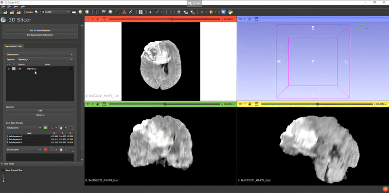

# Segment Any Tumour: An Uncertainty-Aware Vision Foundation Model for Whole-Body Analysis
This repo contains the supported pytorch code and configuration files to reproduce the results of Segment Any Tumour: An Uncertainty-Aware Vision Foundation Model for Whole-Body Analysis Article.


## Abstract

Prompt-driven vision foundation models, such as the Segment Anything Model, have shown adaptability in computer vision, but their use in medical imaging remains challenging due to heterogeneous anatomy, artefacts, and low-contrast tumour boundaries. This is particularly difficult in whole-body tumour analysis, where models must transfer across modalities, anatomies, and tumour appearances. Here, we present Segment Any Tumour 3D (SAT3D), a lightweight volumetric foundation model for generalisable tumour segmentation across diverse medical imaging modalities, organs, and cohorts. SAT3D integrates a shifted-window vision transformer with critic-guided uncertainty-aware training, using confidence maps as dense prompts to guide boundary prediction in ambiguous regions. We benchmark SAT3D against vision foundation models, prompt-driven and task-specific methods across 11 public datasets. Trained on 17,075 three-dimensional volume-mask pairs, SAT3D shows robust generalisation, including in out-of-distribution settings, and is supported by a 3D-Slicer plugin for interactive segmentation, underscoring SAT3D’s potential as a scalable foundation model for medical image analysis.

## Link to full paper:
Pre-print version: [https://www.nature.com/articles/s41467-026-76531-2](https://www.nature.com/articles/s41467-026-76531-2)

## Proposed Architecture


## System requirements
Under this section, we provide details on the environmental setup and dependencies required to train/test the SAT3D model.
This software was originally designed and run on a system running Ubuntu.
<br>
All the experiments are conducted on Ubuntu 20.04 Focal version with Python 3.9.
<br>
To train SAT3D with the given settings, the system requires a GPU with at least 40GB. All the experiments are conducted on Nvidia A6000 2 GPUs (Tested on Setonix AMD GPUs).
(Not required any non-standard hardware)
<br>
To test the model's performance on unseen test data, the system requires a GPU with at least 24 GB.

### Create a virtual environment

```bash 
pip install virtualenv
virtualenv -p /usr/bin/python3.9 venv
source venv/bin/activate
```

### Installation guide 

- Install torch & other dependencies :
```bash 
pip install -r requirements.txt
```

### Typical Install Time 
This depends on the internet connection speed. It would take around 15-30 minutes to create the environment and install all the dependencies required.

## Dataset Preparation
The experiments are conducted on 14 publicly available datasets. Data splits are provided in the figshare project.


## Figshare Project Page
All the pre-trained models, figures, evaluations, a video on how the 3D slicer plugin works, and the source code are included in this project page [link](https://figshare.com/s/a8c19cd60a57e975390b)

- DOI: https://doi.org/10.6084/m9.figshare.30155497

## Trained Model Weights
Download trained model weights from this shared drive [link](https://drive.google.com/drive/folders/1yV7-YMn9TpGaGHVmv2Vx-fFOuagT6L3n?usp=sharing).

## Running Demo
The demonstration is created using 3D Slicer. The code for the slicer plugin is located in the SAT3D-slicer folder.

## Train Model
```bash
nohup python train_sat3D.py &> sat3D.out &
```

## Demo 




## Acknowledgements

This repository makes liberal use of code from [SAM-Med3D](https://github.com/uni-medical/SAM-Med3D) and [FastSAM3D_slicer](https://github.com/arcadelab/FastSAM3D_slicer/tree/main)

## Citing SAT3D

If you find this repository useful, please consider giving us a star ⭐ and cite our work:

```bash
@misc{peiris2025segmenttumouruncertaintyawarevision,
      title={Segment Any Tumour: An Uncertainty-Aware Vision Foundation Model for Whole-Body Analysis}, 
      author={Himashi Peiris and Sizhe Wang and Gary Egan and Mehrtash Harandi and Meng Law and Zhaolin Chen},
      year={2025},
      eprint={2511.09592},
      archivePrefix={arXiv},
      primaryClass={eess.IV},
      url={https://arxiv.org/abs/2511.09592}, 
}
```

